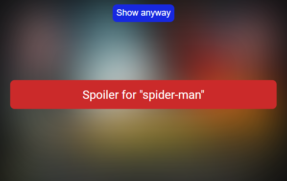

<a name="readme-top"></a>

<!-- PROJECT LOGO -->
<br />
<div align="center">

  <a href="https://github.com/hubertolafaille/spoiler_checker_for_youtube">
    
  </a>

<h3 align="center">Spoiler Checker for YouTube</h3>

  <p align="center">
    A Chrome extension to dodge spoilers on YouTube
    <br />
    <br />
  </p>
</div>


<!-- TABLE OF CONTENTS -->
<details>
  <summary>Table of Contents</summary>
  <ol>
    <li>
      <a href="#about-the-project">About The Project</a>
      <ul>
        <li><a href="#built-with">Built With</a></li>
      </ul>
    </li>
    <li>
      <a href="#getting-started">Getting Started</a>
      <ul>
        <li><a href="#prerequisites">Prerequisites</a></li>
        <li><a href="#installation">Installation</a></li>
      </ul>
    </li>
    <li><a href="#usage">Usage</a></li>
    <li><a href="#license">License</a></li>
  </ol>
</details>


<!-- ABOUT THE PROJECT -->
## About The Project

<p align="center"></p>

The 'Spoiler Checker for YouTube' Chrome extension is specifically designed to protect YouTube users from unwanted spoilers. It works by analyzing video titles, descriptions, and tags, and then comparing them with the keywords you have selected. Thanks to this, the extension ensures a spoiler-free viewing experience on YouTube.

<p align="right">(<a href="#readme-top">back to top</a>)</p>


### Built With

<br>
<ul>
    <li> HTML 5</li>
    <li> CSS 3</li>
    <li> Javascript</li>
    <li> Docker</li>
    <li> Spring</li>
    <li> Maven</li>
    <li> Java</li>
    <li> YouTube data API</li>
</ul>

<p align="right">(<a href="#readme-top">back to top</a>)</p>


<!-- GETTING STARTED -->
## Getting Started

To begin using the 'Spoiler Checker for YouTube', please follow the steps outlined in the Prerequisites, Installation, and Usage sections of this document, which will guide you through the process of setting up and using the extension.

### Prerequisites

You'll need :
* Chrome browser that you can get at https://www.google.com/intl/en/chrome/
* Docker that you can get at https://www.docker.com/get-started/
* YouTube data API and a API key that you can get at https://developers.google.com/youtube/v3/getting-started

### Installation

1. Download the zip of the project https://github.com/hubertolafaille/spoiler_checker_for_youtube/archive/refs/heads/main.zip and extract it.
   - Or, you can clone the project with git if you prefer
   ```sh
   git clone https://github.com/hubertolafaille/spoiler_checker_for_youtube.git
   ```
2. Enter your API key, application name and a chose username and password in `/server/src/main/resources/application.properties`
   ```properties
   youtube.api.key=ENTER_YOUR_API_KEY
   youtube.application.name=ENTER_YOUR_YOUTUBE_APPLICATION_NAME

   spring.security.user.name=CHOOSE_AND_ENTER_A_USERNAME
   spring.security.user.password=CHOOSE_AND_ENTER_A_PASSWORD
   ```
3. Build and run a docker image of the server 
   - Open a terminal in `/server/` and execute :
   ```sh
    docker build -t CHOOSE_AND_ENTER_A_NAME_FOR_THE_DOCKER_IMAGE .
   ```
    - Then to run it, execute :
   ```sh
    docker run -d -p CHOOSE_AND_ENTER_A_AVAILABLE_PORT:8080 --name CHOOSE_AND_ENTER_A_NAME_FOR_THE_DOCKER_CONTAINER YOUR_DOCKER_IMAGE_NAME
   ```
4. Open the file `/ext/scripts/content.js` with a text editor and replace the API_URL value with your server's address. For instance, if your server is running locally on port 8080, use http://localhost:8080. Be sure to use the correct address that matches your server configuration.
   ```js
   const API_URL = 'ENTER_YOUR_SERVER_ADDRESS';
   ```
5. In Chrome, load the extension by navigating to the extensions page (chrome://extensions/), enabling Developer Mode, and then selecting 'Load unpacked'. Choose the `/ext/` folder. For detailed instructions, see [Load an unpacked extension](https://developer.chrome.com/docs/extensions/mv3/getstarted/development-basics/#load-unpacked ).
   

<p align="right">(<a href="#readme-top">back to top</a>)</p>


<!-- USAGE EXAMPLES -->
## Usage

- Visit https://www.youtube.com
- You can click on the icon of the extension to open it
- You can add keyword. If a video title, description or tag match, the extension will blur it.
- You can go to the settings to have more options like delete keywords previously added.
- You can switch into light or dark theme.
- You can turn off the extension in the extension page (chrome://extensions/).

<p align="right">(<a href="#readme-top">back to top</a>)</p>

<!-- LICENSE -->
## License

Distributed under the MIT License. See `LICENSE.txt` for more information.

<p align="right">(<a href="#readme-top">back to top</a>)</p>
